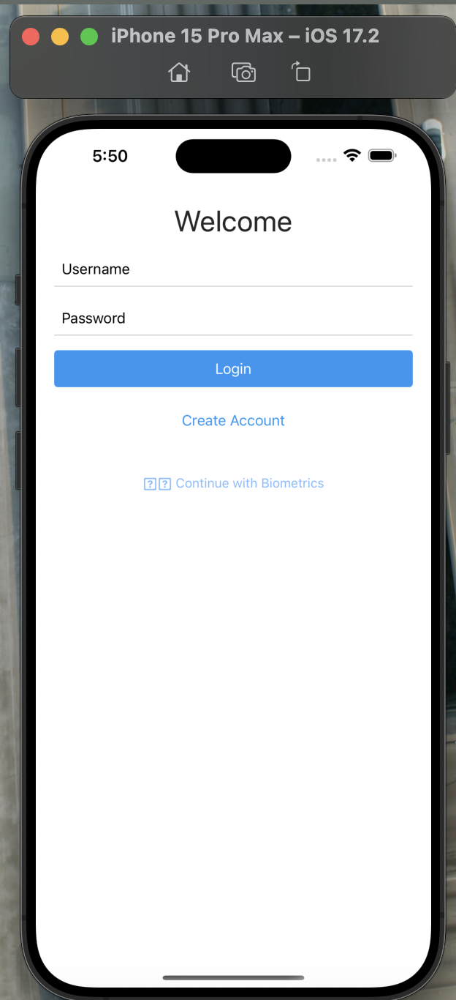
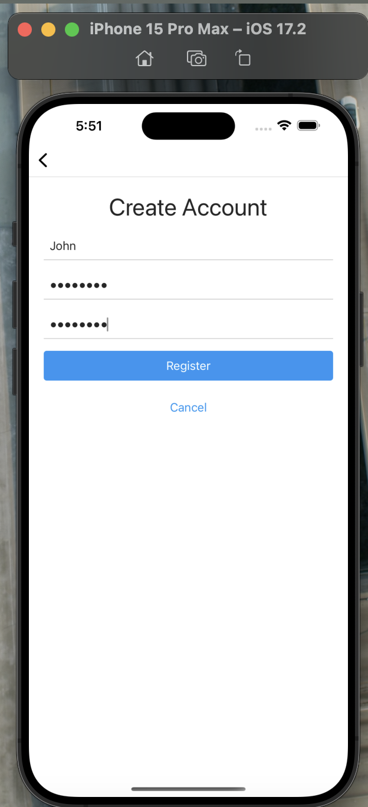
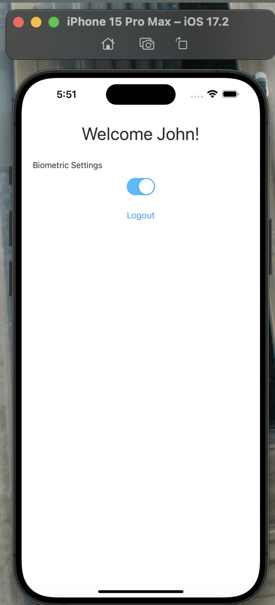
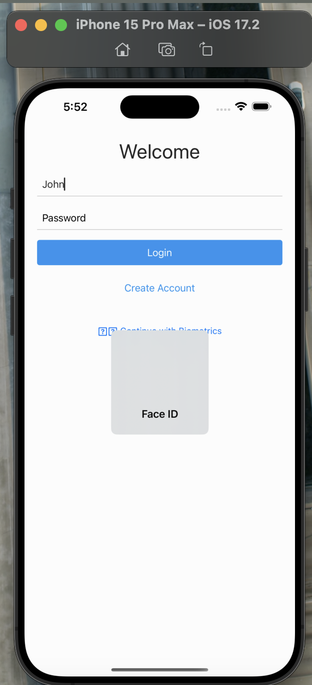

# BioMetric Authentication App

A NativeScript mobile app implementing biometric authentication (Face ID/Fingerprint) with secure local storage.

## Features
- User registration/login
- Biometric authentication (Face ID/Fingerprint)
- Secure credential storage
- Cross-platform (Android/iOS)

## Installation
```bash
git clone https://github.com/your-username/BioMetricApp.git
cd BioMetricApp
npm install
```

## Usage

### Run on Android
```bash
ns run android
```

### Run on iOS
```bash
ns run ios
```

### Biometric Setup
1. Register a new user
2. Enable biometric authentication in settings
3. Log out and use biometric login
4. Just Provide Username and click on 'Continue with Biometics'

## Build for Release
```bash
ns build android --release \
  --key-store-path path/to/your.keystore \
  --key-store-password YOUR_STORE_PASS \
  --key-store-alias YOUR_ALIAS \
  --key-store-alias-password YOUR_ALIAS_PASS
```

## Requirements
- Node.js 18+
- NativeScript CLI (`npm install -g nativescript`)
- Android Studio/Xcode (for builds)

## Contributing
1. Fork the repository
2. Create a feature branch (`git checkout -b feature/your-feature`)
3. Commit changes (`git commit -m 'Add feature'`)
4. Push to branch (`git push origin feature/your-feature`)
5. Open a Pull Request






## License
[MIT License](LICENSE)